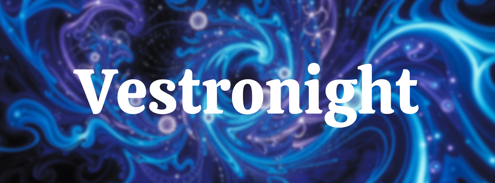

# Welcome to My Corner of the Internet 👋

👨‍💻 Software Engineer | Full-Stack Developer 🚀 
Hey there! I'm a passionate Software Engineer who thrives on building high-performance applications with cutting-edge technologies. Whether it's crafting seamless user experiences with React, Next.js, and React Native, or architecting robust backend solutions with Node.js, Express, and NestJS, I love bringing ideas to life with clean, scalable code. 

🛠 Tech Arsenal: 
⚡ Frontend: React, Next.js, React Router, TailwindCSS, ShadCN 
⚡ Backend: Node.js, Express.js, NestJS, WebSockets 
⚡ Databases: MongoDB (Mongoose), PostgreSQL (Prisma) 
⚡ DevOps & Tools: Docker, Linux, Neovim 
⚡ Languages: JavaScript, TypeScript 

💡 What drives me? 
Crafting performant, scalable, and maintainable applications 
Leveraging modern frameworks and best practices 
Writing clean and efficient code 
Automating workflows and optimizing developer experience 

📌 Always exploring, always building.  

### 
My GitHub stats

